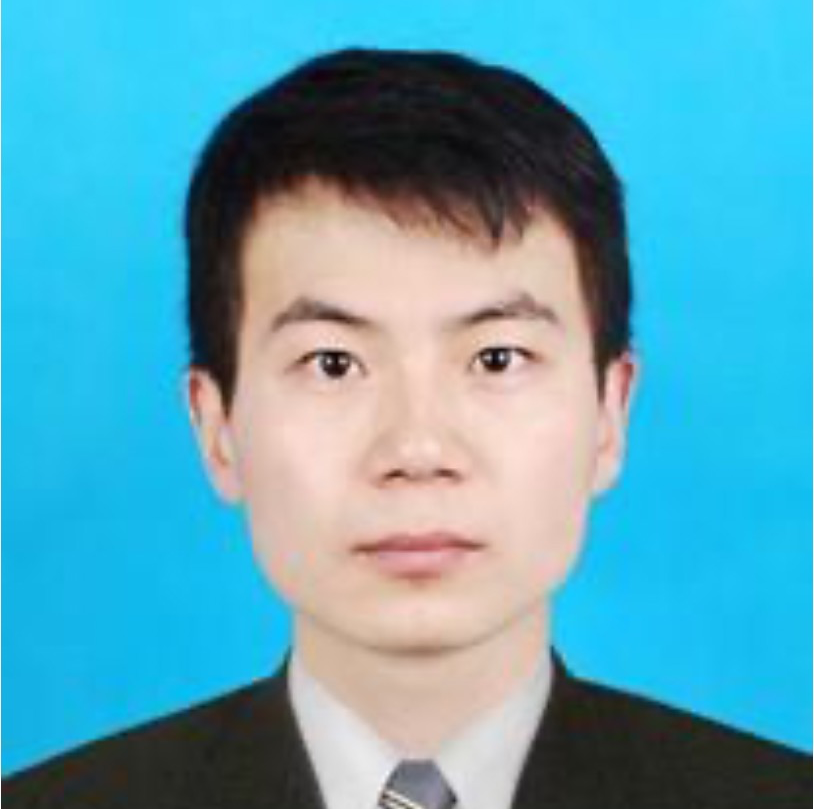

Welcome to our [KDD'22](https://kdd.org/kdd2022/) Tutorial!

##  Tutorial Date, Time, Location
- **Date**: TBD
- **Time**: TBD
- **Location**: TBD


## Tutorial Abstract

Time series analysis is ubiquitous and important in various areas, such as Artificial Intelligence for IT Operations (AIOps) in cloud computing, AI-powered Business Intelligence in E-commerce, Artificial Intelligence of Things (AIoT), etc. In real-world scenarios, time series data often exhibit complex patterns with trend, seasonality, outlier and noise. In addition, as more time series data are collected and stored, how to handle the huge amount of data efficiently is crucial in many applications. We note that these significant challenges exist in various tasks like forecasting, anomaly detection, and fault cause localization. Therefore, how to design effective and efficient time series models for different tasks, which are robust to address the aforementioned challenging patterns and noise in real scenarios, is of great theoretical and practical interests.

In this tutorial, we provide a comprehensive and organized tutorial on the state-of-the-art algorithms of robust time series analysis, ranging from traditional statistical methods to the most recent deep learning based methods. We will not only introduce the principle of time series algorithms, but also provide insights into how to apply them effectively in practical real-world industrial applications. Specifically, we organize the tutorial in a bottom-up framework. We first present preliminaries from different disciplines including robust statistics, signal processing, optimization, and deep learning. Then, we identify and discuss those most-frequently processing blocks in robust time series analysis, including periodicity detection, trend filtering, seasonal-trend decomposition, and time series similarity. Lastly, we discuss recent advances in multiple time series tasks including forecasting, anomaly detection, fault cause localization, and autoscaling, as well as practical lessons of large-scale time series applications from an industrial perspective. 


## Tutorial Outline and Materials

1. Preliminaries [[slides]]()
   - Real-world Challenges and Needs for Robustness
   - Robust Statistics: Robust Regression, M-estimators
   - Signal Processing: Fourier, Wavelet 
   - Optimization Algorithms: Alternating Direction Method of Multipliers (ADMM), Majorize-Minimization (MM)
   - Deep Learning: RNN, CNN, GNN, Transformer, Data Augmentation for Time Series


2. Robust Time Series Processing Blocks [[slides]]()
   - Time Series Periodicity Detection
   - Time Series Trend Filtering
   - Time Series Seasonal-Trend Decomposition
   - Time Series Similarity

3. Robust Time Series Applications and Practices [[slides]]()
   - Forecasting: Tree Model, Deep Ensemble, Transformer, and Case Studies
   - Anomaly Detection: Decomposition Model, Deep State Space Model, Transformer, and Case Studies
   - Fault Cause Localization: Rule Set Learning, Root Cause Analysis, and Case Studies
   - Autoscaling: Query Modeling, Scaling Decision, and Case Studies


## Key References Published by Lecturers

- **[IJCAI'21]** Qingsong Wen, Liang Sun, Fan Yang, Xiaomin Song, Jingkun Gao, Xue Wang, Huan Xu, "Time Series Data Augmentation for Deep Learning: A Survey," in the 30th International Joint Conference on Artificial Intelligence (IJCAI 2021), Montreal, Canada, Aug. 2021. [Oral] [arXiv]. Note: Selected by Paper Digest into **Most Influential IJCAI Papers (Version: 2022-02), Rank 1st** (1 out of 15 out of 600+ IJCAI'21 papers) [link]
- **[ICASSP'22]** Chaoli Zhang*, Zhiqiang Zhou*, Yingying Zhang*, Linxiao Yang*, Kai He*, Qingsong Wen*, Liang Sun* (*Equally Contributed), "NetRCA: An Effective Network Fault Cause Localization Algorithm," in Proc. IEEE 47th International Conference on Acoustics, Speech, and Signal Processing (ICASSP 2022), Singapore, May 2022. [arXiv] [Oral]. Note: **ICASSP‘22 AIOps Challenge, First Place** (1/382, Team Name: MindOps) [link]
- **[ICDE'22]** Huajie Qian, Qingsong Wen, Liang Sun, Jing Gu, Qiulin Niu, Zhimin Tang, "RobustScaler: QoS-Aware Autoscaling for Complex Workloads," in Proc. IEEE 38th International Conference on Data Engineering (ICDE 2022), Kuala Lumpur, Malaysia, May 2022. [arXiv] [Oral], Media Coverage: [Mo4Tech] [Alicloudnative] [Zhihu] [1024sou]
- **[KDD'20]** Qingsong Wen, Zhe Zhang, Yan Li, Liang Sun, "Fast RobustSTL: Efficient and Robust Seasonal-Trend Decomposition for Time Series with Complex Patterns," in Proc. 26th ACM SIGKDD International Conference on Knowledge Discovery & Data Mining (KDD 2020), San Diego, CA, Aug. 2020. [Oral] [paper]
- **[SIGMOD'21]** Qingsong Wen, Kai He, Liang Sun, Yingying Zhang, Min Ke, Huan Xu, "RobustPeriod: Time-Frequency Mining for Robust Multiple Periodicity Detection," in Proc. ACM SIGMOD International Conference on Management of Data (SIGMOD 2021), Xi'an, China, Jun. 2021. [Oral] [arXiv]
- **[AAAI'19]** Qingsong Wen, Jingkun Gao, Xiaomin Song, Liang Sun, Huan Xu, Shenghuo Zhu, "RobustSTL: A Robust Seasonal-Trend Decomposition Algorithm for Long Time Series," in Proc. 33th AAAI Conference on Artificial Intelligence (AAAI 2019), Honolulu, Hawaii, Jan. 2019. [Oral] [arXiv], Media Coverage: [Alibaba Tech]
- **[IJCAI'19]** Qingsong Wen, Jingkun Gao, Xiaomin Song, Liang Sun, Jian Tan, "RobustTrend: A Huber Loss with a Combined First and Second Order Difference Regularization for Time Series Trend Filtering," in Proc. 28th International Joint Conference on Artificial Intelligence (IJCAI 2019), Macao, China, Aug. 2019. [Oral] [arXiv]
- **[ICASSP'20]** Qingsong Wen, Zhengzhi Ma, Liang Sun, "On Robust Variance Filtering and Change of Variance Detection," in Proc. IEEE 45th International Conference on Acoustics, Speech, and Signal Processing (ICASSP 2020), Barcelona, Spain, May 2020. [Oral] [paper]
- **[arXiv'22]** Qingsong Wen, Tian Zhou, Chaoli Zhang, Weiqi Chen, Ziqing Ma, Junchi Yan, Liang Sun, "Transformers in Time Series: A Survey," in arXiv preprint arXiv:2202.07125, 2022 [arXiv] [Web]
- **[arXiv'22]** Tian Zhou, Ziqing Ma, Qingsong Wen, Xue Wang, Liang Sun, Rong Jin, "FEDformer: Frequency Enhanced Decomposed Transformer for Long-term Series Forecasting," in arXiv preprint arXiv:2201.12740, 2022 [arXiv]
- **[ICASSP'21]** Qingyang Xu, Qingsong Wen, Liang Sun, "Two-Stage Framework for Seasonal Time Series Forecasting," in Proc. IEEE 46th International Conference on Acoustics, Speech, and Signal Processing (ICASSP 2021), Toronto, Canada, Jun. 2021. [Oral] [arXiv]
- **[ICASSP'21]** Linxiao Yang, Qingsong Wen, Bo Yang, Liang Sun, "A Robust and Efficient Multi-Scale Seasonal-Trend Decomposition," in Proc. IEEE 46th International Conference on Acoustics, Speech, and Signal Processing (ICASSP 2021), Toronto, Canada, Jun. 2021. [Oral] [paper]
- **[KDD'20 WS]** Jingkun Gao, Xiaomin Song, Qingsong Wen, Pichao Wang, Liang Sun, Huan Xu, "RobustTAD: Robust Time Series Anomaly Detection via Decomposition and Convolutional Neural Networks,"  in ACM SIGKDD Workshop on Mining and Learning from Time Series (KDD-MiLeTS 2020), San Diego, CA, Aug. 2020. [paper] [arXiv_extended_version]
- **[TKDE'22]** Longyuan Li, Junchi Yan, Qingsong Wen, Yaohui Jin, and Xiaokang Yang, "Learning Robust Deep State Space for Unsupervised Anomaly Detection in Contaminated Time-Series," IEEE Transactions on Knowledge and Data Engineering (TKDE), 2022. [paper]
- **[CIKM'21]** Yingying Zhang, Zhengxiong Guan, Huajie Qian, Leili Xu, Hengbo Liu, Qingsong Wen, Liang Sun, Junwei Jiang, Lunting Fan, Min Ke, "CloudRCA: A Root Cause Analysis Framework for Cloud Computing Platforms," in Proc. 30th ACM International Conference on Information and Knowledge Management (CIKM 2021), Queensland, Australia, Nov. 2021. [Oral] [arXiv]
- **[ICCV'19]** Linxiao Yang, Ngai-Man Cheung, Jiaying Li, and Jun Fang. Deep clustering by gaussian mixture variational autoencoders with graph embedding. In Proc. of the IEEE/CVF International Conference on Computer Vision (ICCV 2019), pages 6440–6449, 2019. [paper]
- **[KDD'19]** Ming Lin, Xiaomin Song, Qi Qian, Hao Li, Liang Sun, Shenghuo Zhu, and Rong Jin. 2019. Robust Gaussian process regression for real-time high precision GPS signal enhancement. In Proc. of the 25th ACM SIGKDD International Conference on Knowledge Discovery & Data Mining (KDD 2019). 2838–2847. [arXiv]
- **[AAAI'22]** Yan Li, Rui Xia, Chunchen Liu, and Liang Sun. 2022. A Hybrid Causal Structure Learning Algorithm for Mixed-type Data. In Proc. of the AAAI Conference on Artificial Intelligence (AAAI 2022), 2022. [paper]
- **[NeurIPS'21]** Fan Yang, Kai He, Linxiao Yang, Hongxia Du, Jingbang Yang, Bo Yang, and Liang Sun. 2021. Learning Interpretable Decision Rule Sets: A Submodular Optimization Approach. in Proc. of Advances in Neural Information Processing Systems (NeurIPS 2021), 2021. [paper]


## Short Bio of Lecturers

 **[Qingsong Wen](https://sites.google.com/site/qingsongwen8)** is currently a Staff Engineer / Team Leader with Alibaba DAMO Academy-Decision Intelligence Lab at Bellevue, WA, USA, working in the areas of intelligent time series analysis, data-driven intelligence decisions, machine learning, and signal processing. Before that, he worked at Futurewei, Qualcomm, and Marvell in the areas of big data and signal processing, and received his M.S. and Ph.D. degrees in Electrical and Computer Engineering from Georgia Institute of Technology, Atlanta, USA. He has published over 30 top-ranked conference and journal papers, and won the First Place in 2022 ICASSP Grand Challenge (AIOps in Networks) Competition. He is an Associate Editor for Neurocomputing, Guest Editor for Pattern Recognition, Guest Editor for Applied Energy, and regularly served as an SPC/PC member of the major DM/ML/AI conferences including KDD, ICDM, AAAI, IJCAI, etc.


 **[Linxiao Yang]()** is currently a Senior Engineer with Alibaba DAMO Academy, working in the fields of time series analysis, pattern mining, and interpretable machine learning. He received the B.S. degree in electrical engineering from Southwest Jiaotong University, Chengdu, China, and the Ph.D. degree in Communication and Information Engineering from the University of Electronic of Science and Technology of China, Chengdu, China. He won the First Place in 2022 ICASSP Grand Challenge (AIOps in Networks) Competition. His research interests include data-driven decision making, efficient optimization methods, interpretable machine learning, and signal processing.


 **[Tian Zhou]()** is currently a Senior Algorithm Engineer in Alibaba DAMO Lab, working mainly on time series forecasting and sequence modeling. He has worked on all aspects ranging from practical model designing to theoretical foundations. Prior to joining Alibaba, Tian obtained a BS in chemistry from Tsinghua University, an MS in Statistics from Rutgers-New Brunswick, an MS in Machine Learning from Rutgers-New Brunswick, and a PhD from Rutgers-New Brunswick, focusing on computational chemistry for organometalic catalysts.


 **[Liang Sun](https://scholar.google.com/citations?user=8JbrsgUAAAAJ&hl=en)** is currently a Senior Staff Engineer / Engineering Director at DAMO Academy, Alibaba Group, Bellevue, USA. He received B.S.(2003) from Nanjing University, and Ph.D.(2011) from Arizona State University, both in computer science. Dr. Sun has over 30 publications including 2 books in the fields of machine learning and data mining. His work on dimensionality reduction won the KDD 2010 Best Research Paper Award Honorable Mention, and won the Second Place in KDD Cup 2012 Track 2 Competition. He also won the First Place in 2022 ICASSP Grand Challenge (AIOps in Networks) Competition. At Alibaba Group, he is working on temporal data mining, including time series anomaly detection, forecasting, and their applications.


## Cite our work
If you find our work useful, please cite our work
- KDD 2022 Tutorial (Robust Time Series Analysis and Applications: An Industrial Perspective)
```
@inproceedings{wen2022kddtimeseries,
  title={Robust Time Series Analysis and Applications: An Industrial Perspective},
  author={Wen, Qingsong and Yang, Linxiao and Zhou, Tian and Sun, Liang},
  booktitle={Proceedings of the 28th ACM SIGKDD Conference on Knowledge Discovery \& Data Mining},
  pages={1--2},
  year={2022}
}
```

## Previous Tutorial
- IJCAI 2021 Tutorial: [Robust Time Series Analysis: from Theory to Applications in the AI Era](https://sites.google.com/view/timeseries-tutorial-ijcai-2022)

<script type='text/javascript' id='clustrmaps' src='//cdn.clustrmaps.com/map_v2.js?cl=ffffff&w=300&t=tt&d=6-pWt_hGW24fe4IIRD8g4PNbhnPT-B-QCUL1m4aUXVw'></script>


